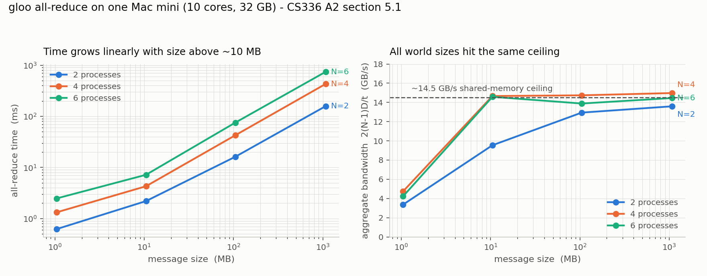

# lm-systems

Distributed training from scratch: ring all-reduce, data-parallel training, and
communication benchmarks. Companion to [lm-from-scratch](https://github.com/xueweiphy/lm-from-scratch),
which holds the model; this repo holds the systems needed to train it at scale.
Follows CS336 Assignment 2, section 5.

## What's here

| folder | contents |
|---|---|
| `allreduce/` | ring all-reduce in numpy — scatter-reduce then all-gather, 2(N-1) steps — with tests against a naive sum |
| `ddp/` | `comm_benchmark.py`: times `dist.all_reduce` over message size and world size. `naive_ddp.py`: a minimal `DDP` wrapper — broadcast parameters from rank 0, all-reduce gradients after `backward()` — verified against single-process training |
| `results/` | benchmark data and plot |

## Result so far

gloo all-reduce on one Mac mini (10 cores, 32 GB), float32, 1 MB to 1 GB, 2/4/6 processes:



Above ~10 MB every world size converges on the same **~14.5 GB/s** of aggregate
bandwidth, 2(N-1)·D / t. That is the machine's memory bandwidth, shared by all
processes — so time grows as (N-1), not as the near-flat 2(N-1)/N a real network
would give a ring. One machine is not a network; the multi-node numbers are still to come.

Below ~10 MB the cost is per-step latency, ~150-240 µs per collective. That gap is
why flat (single-buffer) DDP exists.

## Run

```
pytest allreduce/                    # ring all-reduce correctness
python ddp/comm_benchmark.py         # writes allreduce.csv to the current directory
python ddp/naive_ddp.py              # 4-process DDP; all ranks print identical weights
```

CPU only, gloo backend. No GPU needed for anything here yet.
