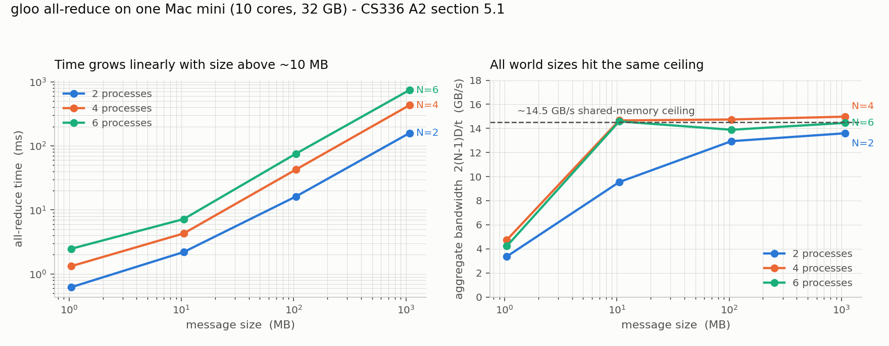

# lm-systems

Systems for training a language model from scratch: ring all-reduce, data-parallel
training, communication benchmarks, and attention memory/time benchmarks. Companion to [lm-from-scratch](https://github.com/xueweiphy/lm-from-scratch),
which holds the model; this repo holds the systems needed to train it at scale.
Follows CS336 Assignment 2 (sections 4 and 5).

## What's here

| folder | contents |
|---|---|
| `allreduce/` | ring all-reduce in numpy — scatter-reduce then all-gather, 2(N-1) steps — with tests against a naive sum |
| `ddp/` | `comm_benchmark.py`: times `dist.all_reduce` over message size and world size. `naive_ddp.py`: a minimal `DDP` wrapper — broadcast parameters from rank 0, all-reduce gradients after `backward()` — verified against single-process training |
| `attention/` | `bench_attention.py`: forward/backward time and memory of naive causal attention (own softmax, single head, batch 8) over sequence length and head dimension |
| `results/` | benchmark data and plots |

## Result so far

gloo all-reduce on one Mac mini (10 cores, 32 GB), float32, 1 MB to 1 GB, 2/4/6 processes:



Above ~10 MB every world size converges on the same **~14.5 GB/s** of aggregate
bandwidth, 2(N-1)·D / t. That is the machine's memory bandwidth, shared by all
processes — so time grows as (N-1), not as the near-flat 2(N-1)/N a real network
would give a ring. One machine is not a network; the multi-node numbers are still to come.

Below ~10 MB the cost is per-step latency, ~150-240 µs per collective. That gap is
why flat (single-buffer) DDP exists.

## Naive attention: time and memory

A100-40GB, MIG slice 3g.20gb (19.8 GiB free), fp32, batch 8, single head, 100 runs each.
Ranges are over head dimension D = 16 ... 128 (`results/attention_a100mig.csv`).

| T | forward ms | backward ms | MiB in use before backward | peak MiB |
|---|---|---|---|---|
| 256 | 0.40 | 1.0 | 13 - 24 | 29 - 35 |
| 1024 | 1.40 - 1.65 | 3.2 - 3.5 | 83 - 97 | 213 - 237 |
| 4096 | 18.1 - 22.1 | 41.8 - 46.1 | 1065 - 1121 | 3119 - 3217 |
| 8192 | 71.5 - 87.5 | 161 - 178 | 4193 - 4305 | 12397 - 12593 |
| 16384 | OOM | | | |

With S = B·T²·4 bytes (one float T×T tensor), the forward keeps **2 S** alive for backward
(the `exp` output and the attention probabilities) plus a T² byte mask; forward + backward
peaks at about **6 S**. At T = 8192 that predicts 4096 + 64 + 32 = 4192 MiB against 4193 measured.
At T = 16384, S = 8 GiB and the forward needs a third T×T tensor before it finishes, so it
runs out of memory for every D.

Time grows as T² (3.94x from 4096 to 8192) while 8x more head dimension costs only 22 %:
the elementwise T² operations, limited by memory bandwidth, dominate the matmuls. Both
results are the case for FlashAttention: save only Q, K, V and the per-row log-sum-exp,
recompute by tiles in backward, never materialise the T×T matrix.

## Run

```
pytest allreduce/                    # ring all-reduce correctness
python ddp/comm_benchmark.py         # writes allreduce.csv to the current directory
python ddp/naive_ddp.py              # 4-process DDP; all ranks print identical weights
python attention/bench_attention.py  # needs a CUDA GPU; writes pytorch_attention.csv
```

The all-reduce and DDP parts are CPU only (gloo backend); the attention benchmark needs a GPU.
